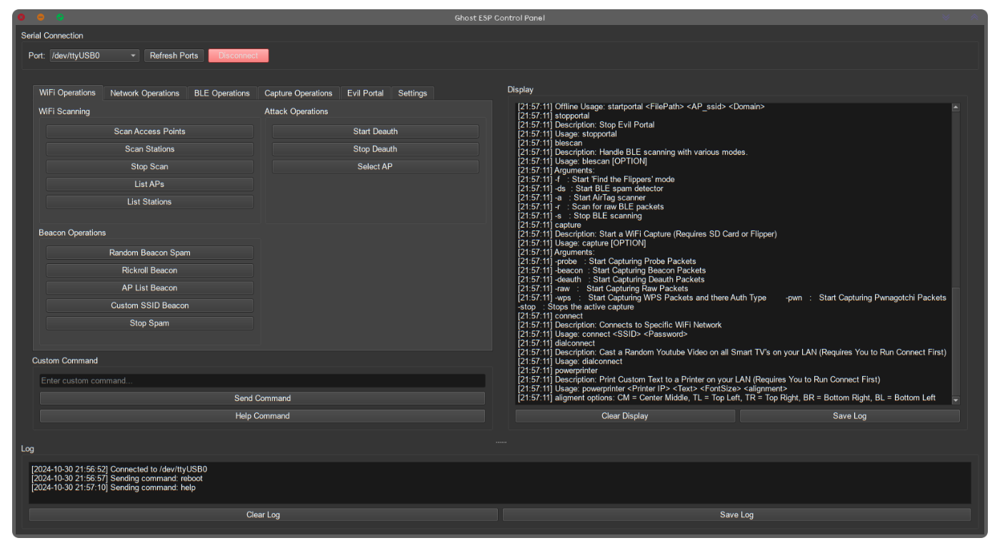

# Ghost ESP Control Panel - README

## Overview

The **Ghost ESP Control Panel** is a GUI application that facilitates control and communication with an ESP32 microcontroller over a serial connection. Developed with Python and PyQt6, this tool offers functions for WiFi and BLE scanning, packet capturing, and custom command execution.

## Features

- **Serial Connection Management**: Connect to and communicate with ESP32 devices via serial port.
- **WiFi Operations**: Scan networks, list access points and stations, perform de-authentication, and send beacon spam.
- **BLE Operations**: Scan for BLE devices, find specific devices (e.g., AirTag), and stop scans.
- **Packet Capture**: Capture packets across multiple types, including deauthentication, WPS, and raw data.
- **Custom Command Support**: Execute custom commands directly from the interface.
- **Logging and Display Areas**: Real-time logging of commands and responses, with a display for scan results and status updates.

## Table of Contents

- [Installation](#installation)
- [Usage](#usage)
  - [Starting the Application](#starting-the-application)
  - [Connecting to ESP32](#connecting-to-esp32)
  - [Available Operations](#available-operations)
- [Code Structure](#code-structure)
- [UI](#ui)
- [Troubleshooting](#troubleshooting)

## Installation

### Prerequisites

1. **Python 3.8+**: Ensure Python 3.8 or later is installed on your system.
2. **Dependencies**:
   - Install required packages by running:
     ```bash
     pip install pyserial pyqt6
     ```

3. **Ghost ESP Firmware**: This application is the firmware that can interpret commands sent from the control panel. Please ensure the ESP32 is configured accordingly.

## Usage

### Starting the Application

Run the main script:

```bash
python esp_ghost_control.py
```

### Connecting to ESP32

1. Select a serial port from the dropdown menu in the **Serial Connection** section.
2. Click **Refresh Ports** if the port is not visible.
3. Click **Connect** to initiate the connection.
   - **Note**: The connection status and errors are displayed in the log area.

### Available Operations

#### WiFi Operations

- **Scan Access Points**: Scans for nearby WiFi access points.
- **Start/Stop Deauth**: Initiates or stops a deauthentication command on selected APs.
- **Beacon Spam**: Sends random beacons, a Rickroll beacon, or AP list beacon spam.

#### BLE Operations

- **Find Flippers**: Searches for known "Flipper" BLE devices.
- **AirTag Scanner**: Detects nearby AirTags.
- **Raw BLE Scan**: Initiates a low-level BLE scan.

#### Packet Capture

Captures and logs specific types of packets from nearby networks.

1. **Capture Probes**: Detects WiFi probe requests.
2. **Capture Deauth**: Tracks deauthentication packets.
3. **Capture WPS**: Logs WPS-specific packets.

### Sending Custom Commands

1. Type a custom command into the **Custom Command** input field.
2. Press **Enter** or click **Send Command** to execute.

### Logging and Display

All command responses, statuses, and logs are displayed in the respective areas:

- **Log Area**: Shows timestamps and command-related feedback.
- **Display Area**: Shows structured responses, scan results, and status updates.

## Code Structure

- **`SerialMonitorThread`**: A dedicated thread handling serial data reading, emitting data via `data_received` signal.
- **`ESP32ControlGUI`**: The main GUI class, encapsulating the UI setup, event handling, and command operations.
  - **UI Components**: Organized within tabs for WiFi, BLE, and packet capture operations.
  - **Command Functions**: Encapsulates individual command calls with error handling and logging.

## UI



## Troubleshooting

- **Cannot Connect to ESP32**: Ensure the correct port is selected, and ESP32 is properly flashed and powered.
- **Unexpected Disconnects**: Check for physical connection issues or try lowering the baud rate.
- **Command Errors**: Ensure commands are compatible with the ESP32’s firmware. Some features may require specific firmware configurations.

---

**Note**: This application is intended for development and diagnostic purposes only. Ensure compliance with local regulations when using network diagnostic tools.
